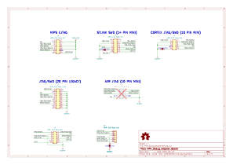

# Why create this repository

I bought Segger J-Link EDU Mini [^SeggerJlinkMini] and STLink V3 mini[^STLINK-V3MODS] (STDC14 Connect) but the connector pitch is 1.27mm, so I couldn't use it to debug the current board, then I designed a debug circuit adapter and opened the source.I made this circuit from Pickit4 debug adapter board [^PICKit-DABTP] product idea.

I used kicad[^KICAD] to design the circuit diagram and layout of the printed circuit board.

- [For STLink V3 mini adapter board repository](https://github.com/tw1chao/STLinkV3_Adapter)

# Schematic

# PCB

[^STLINK-V3MODS]:[UM2502 STLINK-V3MODS and STLINK-V3MINI debugger/programmer tiny probes for STM32 microcontrollers](https://www.st.com/resource/en/user_manual/um2502-stlinkv3mods-and-stlinkv3mini-debuggerprogrammer-tiny-probes-for-stm32-microcontrollers-stmicroelectronics.pdf)

[^PICKit-DABTP]:[PICkit™4 Debugger Adapter Board Target Pinouts](https://microchipdeveloper.com/pickit4:debugger-adapter-pinouts)

[^SeggerJlinkMini]:[The small-size educational debug probe](https://www.segger.com/products/debug-probes/j-link/models/j-link-edu-mini/)

[^KICAD]:[A Cross Platform and Open Source Electronics Design Automation Suite](https://www.kicad.org/)

# License

- Hardware in this repository is licensed under CERN OHL v2.0
[**CERN-OHL-S**](https://ohwr.org/cern_ohl_s_v2.pdf)

